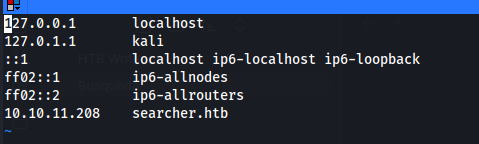

Nmap scan results

```bash
nmap -sC -sV -oA nmap/results 10.10.11.208
```

```
Starting Nmap 7.93 ( https://nmap.org ) at 2023-07-22 20:49 CEST
Nmap scan report for 10.10.11.208
Host is up (0.013s latency).
Not shown: 998 closed tcp ports (conn-refused)
PORT   STATE SERVICE VERSION
22/tcp open  ssh     OpenSSH 8.9p1 Ubuntu 3ubuntu0.1 (Ubuntu Linux; protocol 2.0)
| ssh-hostkey: 
|   256 4fe3a667a227f9118dc30ed773a02c28 (ECDSA)
|_  256 816e78766b8aea7d1babd436b7f8ecc4 (ED25519)
80/tcp open  http    Apache httpd 2.4.52
|_http-title: Did not follow redirect to http://searcher.htb/
|_http-server-header: Apache/2.4.52 (Ubuntu)
Service Info: Host: searcher.htb; OS: Linux; CPE: cpe:/o:linux:linux_kernel

Service detection performed. Please report any incorrect results at https://nmap.org/submit/ .
Nmap done: 1 IP address (1 host up) scanned in 7.81 seconds
```

Add searcher.htb to the `/etc/hosts` file to allow for the resolution:

![[Busqueda.png]]




Looking at the source of the web page I find a reference to a python package/library and github repo `https://github.com/ArjunSharda/Searchor` with version number 2.4.0

![[Busqueda-2.png]]


After grabbing an off-the-shelf exploit from github (https://github.com/twisted007/Searchor_2.4.0_RCE_Python) and running it with the necessary options, I get a shell with the user svc.

![[Busqueda-3.png]]

After installing my public ssh key in the `.ssh/authorized_keys` file I can ssh to the box with an interactive shell.
The landing directory contains a .git folder, exploring the config I find a password that can be used by the svc user to run `sudo -l`.

![[Busqueda-4.png]]

svc:jh1usoih2bkjaspwe92

![[Busqueda-5.png]]

Playing around with the scripts, it seems like the full-checkups commands is executing the `./full-checkups.sh` scripts.
When running outside the `/opt/scripts` directory the commands fails -> likely a relative path was used to specify the file.

![[Busqueda-6.png]]

![[Busqueda-7.png]]

Create a full-checkup.sh python3 revshell -> add execute bit -> run the command -> I get back a root reverse shell and get the flag.

![[Busqueda-8.png]]
